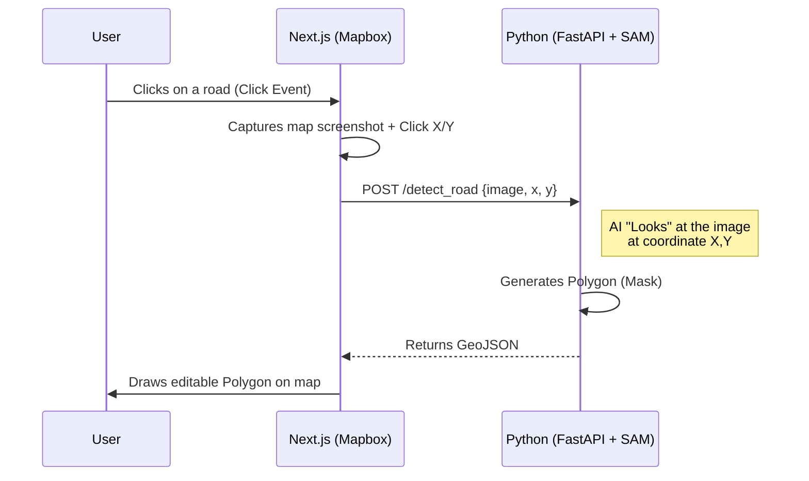

```mermaid
sequenceDiagram
    participant User
    participant NextJS as Next.js (Mapbox)
    participant Python as Python (FastAPI + SAM)
    
    User->>NextJS: Clicks on a road (Click Event)
    NextJS->>NextJS: Captures map screenshot + Click X/Y
    NextJS->>Python: POST /detect_road {image, x, y}
    Note right of Python: AI "Looks" at the image<br/>at coordinate X,Y
    Python->>Python: Generates Polygon (Mask)
    Python-->>NextJS: Returns GeoJSON
    NextJS->>User: Draws editable Polygon on map
```